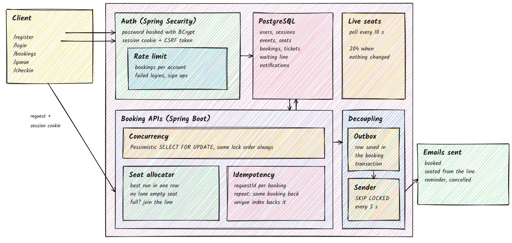

# GrabMySeat

Group seat booking for live events. Specify a group size and area; the server
picks the best contiguous run of seats in one row so nobody in the group sits
alone. If the area is full, users join a queue and get seats automatically when
they come back.



## Tech stack

- **Backend:** Java 21, Spring Boot 3.3, Spring Security, Spring Data JPA (plain SQL where locking matters)
- **Database:** PostgreSQL 16
- **Frontend:** React 18, Vite
- **Payments:** Razorpay
- **Email:** Spring Mail (Mailpit for local dev)

## How it works

### Booking and concurrency

Every booking, queue join and cancel acquires row locks in a fixed order:
event row (shared), user row, area row. This serialises everything touching the
same area while keeping bookings across different areas parallel. The fixed order
prevents deadlocks.

Pessimistic locking over optimistic: in a flash sale nearly every request conflicts,
so optimistic retries would increase contention.

Two partial unique indexes enforce correctness at the database level regardless
of application logic:

- `ticket_seat_live` - one active ticket per seat per event
- `booking_request` - one booking per `(user_id, request_id)`, making retries safe

### Seat allocation

`SeatAllocator` is pure Java with no Spring dependencies. It scores every
contiguous window of the required size by `row_rank * 2 + |mid - centre|`,
picks the lowest-cost window that does not leave a lone seat stranded beside it,
and falls back to splitting across two adjacent rows when no single row fits.
The lone-seat rule relaxes above 90% capacity so the last seats can still sell.

### Queue

A queue join first tries to allocate seats. If none fit it writes a
`queue_request` row. A partial unique index on
`(event_id, user_id) WHERE status = 'WAITING'` prevents double-queuing.
Cancellation matches the next waiting group and updates ticket status in the
same transaction so no concurrent booking can take the freed seats.

### Pre-sale waiting room

Events can set `waiting_room = true`. Users join up to 15 minutes before
`booking_opens_at`. At opening time a scheduled job (every 2 s, Postgres
advisory lock so only one instance runs it) assigns random positions and
admits 200 users with a 10-minute pass. Later arrivals queue in arrival order.
When the event sells out, remaining waiters are marked `SOLD_OUT` and notified.
Booking requires a valid pass.

### Payments

Seats are held as `HELD` for 10 minutes when a Razorpay order is created. The
order is created after the booking row commits, outside the seat lock. Webhooks
are verified with `HMAC-SHA256(order_id|payment_id, webhook_secret)` before any
ticket status changes.

A scheduler (every 15 s) checks expired holds against the Razorpay API to cover
the case where a user paid then closed the tab. Payments arriving after hold
expiry are refunded in full. Refunds go through a `refund` outbox table with
retries; each retry checks for an existing refund first to avoid double-refunding.

### Notifications

Bookings and cancellations write a `notification` row in the same transaction.
A sender claims one row at a time with `FOR UPDATE SKIP LOCKED` so multiple
instances never send the same email. Failed sends retry at roughly 1, 4 and
16 minutes with jitter.

### Rate limiting

Weighted sliding window in `rate_hit` (Postgres). Per-account for booking
and queue joins, not per-IP, because shared college and hostel networks put
many real users behind one address. Per-username for login failures.
Per-IP for registration and password resets.

### Sessions

`spring-session-jdbc` stores sessions in Postgres so any instance can serve
any user without sticky routing.

### Live seat map

Each area has a `version` column incremented on every booking and cancel.
A background loop reads versions every second for events with active SSE viewers
and pushes changes to open `SseEmitter` connections. Cost is one query per
second per instance regardless of viewer count.

## Load testing

`load/flash-sale.js` is a k6 script. 1000 virtual users log in, join the
waiting room, wait for a pass, then run a mix of bookings, double taps, split
groups, over-limit attempts, cancellations and queue operations.
`load/check.sql` verifies the database afterwards.

Results on one machine with app, Postgres and k6 running together, 648 seats:

| Check | Result |
|-------|--------|
| Seats sold | 648 / 648 |
| Seats sold twice | 0 |
| Over-limit bookings | 0 |
| Duplicate bookings from double taps | 0 |
| 5xx errors | 0 / ~3500 requests |
| p95 booking time (no waiting room) | 1.9 s - 4.0 s |
| p95 booking time (through waiting room) | 0.47 s |

```bash
docker exec -i gms-pg psql -U grabmyseat -d grabmyseat -v event=23 < load/seed.sql
docker run --rm --network host -v $PWD/load:/load grafana/k6 run -e EVENT=23 /load/flash-sale.js
docker exec -i gms-pg psql -U grabmyseat -d grabmyseat -v event=23 < load/check.sql
```

## Tests

`BookingConcurrencyTest` runs against a real PostgreSQL instance via Testcontainers:

1. 300 concurrent bookings on the same area - no seat sold twice, every group in one row
2. The same request ID sent twice at once creates one booking
3. Cancellation hands seats to the first waiting group in the same transaction

```bash
./mvnw test
```

## Local setup

```bash
docker compose up --build
```

App on http://localhost:8080. Caught emails (Mailpit) on http://localhost:8025.

Without Compose, with Postgres on port 5442 and Mailpit on 1025:

```bash
npm --prefix frontend install && npm --prefix frontend run build
./mvnw -DskipTests package
java -jar app/target/app-0.0.1-SNAPSHOT.jar
```

Environment variables: `DB_URL`, `DB_USER`, `DB_PASSWORD`, `MAIL_HOST`,
`MAIL_PORT`, `MAIL_USER`, `MAIL_PASSWORD`, `MAIL_AUTH`, `MAIL_TLS`, `MAIL_FROM`,
`RAZORPAY_KEY_ID`, `RAZORPAY_KEY_SECRET`, `RAZORPAY_WEBHOOK_SECRET`, `COOKIE_SECURE`.

## Deployment

Planned for DigitalOcean App Platform with two instances and a managed
PostgreSQL cluster in the Mumbai region. Sessions, rate limits, the notification
outbox and the refund outbox all live in Postgres, so horizontal scaling
needs no additional infrastructure.
